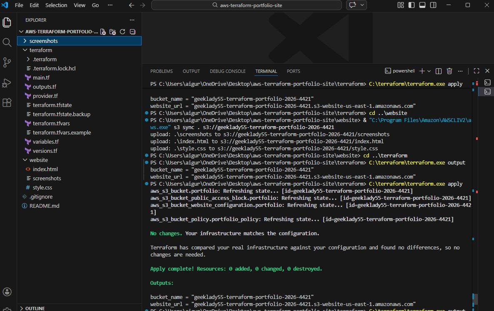
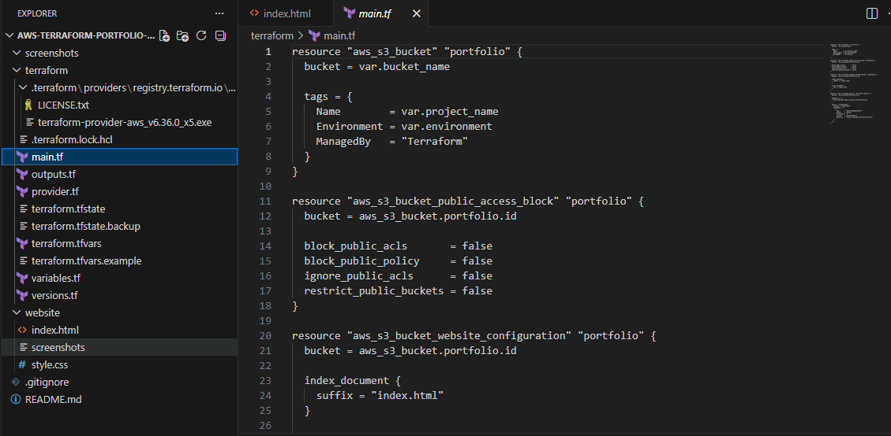
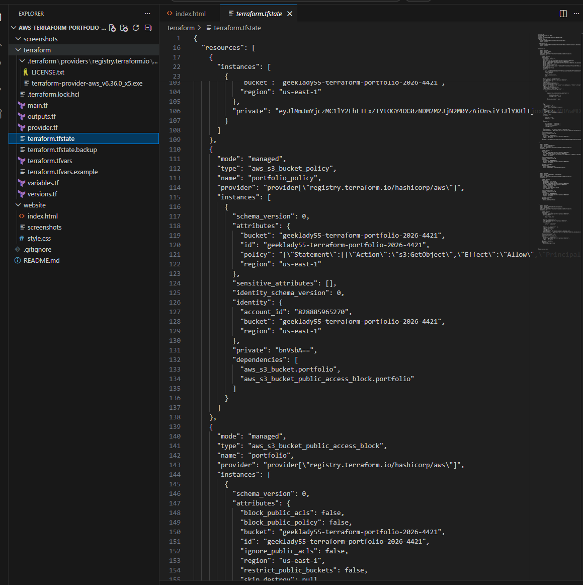
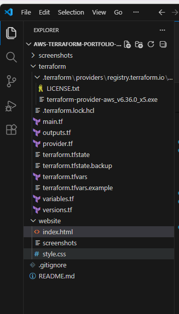
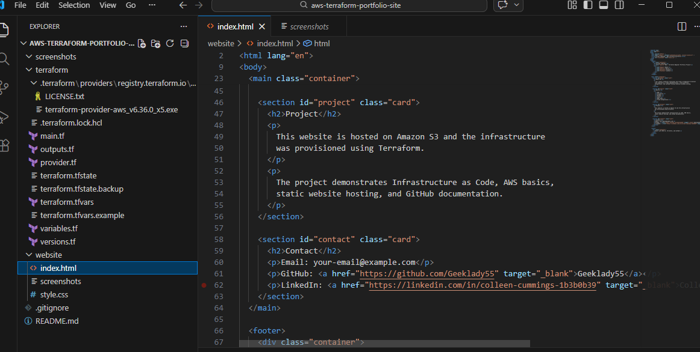
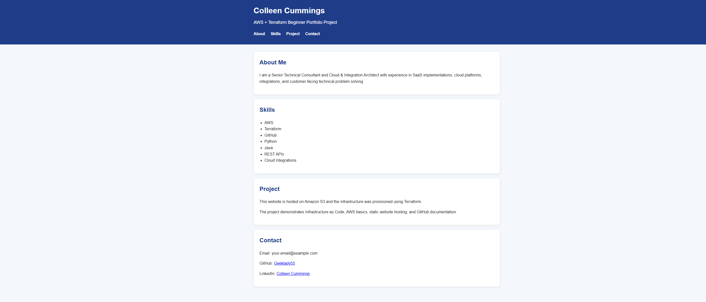

# AWS Terraform Static Website Portfolio

## Project Overview

This project demonstrates how to deploy a static portfolio website using **AWS S3** and **Terraform Infrastructure as Code (IaC)**. The goal of this project was to practice cloud provisioning, automation, troubleshooting IAM permissions, and deploying infrastructure using modern DevOps workflows.

This project simulates a real cloud engineering workflow including provisioning, configuration, deployment, troubleshooting, and documentation.

---

## Technologies Used

AWS S3  
Terraform  
AWS CLI  
GitHub  
HTML/CSS  
Infrastructure as Code  
Cloud Architecture  

---

## Architecture

Local Machine  
↓  
Terraform  
↓  
AWS S3 Bucket  
↓  
Static Website Hosting  
↓  
Public Website

## Simple Architecture Diagram

See [architecture.md](architecture.md)

---

## Project Structure

---

## Features Implemented

Terraform AWS provider configuration  
S3 bucket provisioning  
Static website hosting  
Public access policy configuration  
Bucket policy troubleshooting  
AWS CLI deployment  
Git version control  
Project documentation  

---

## Terraform Deployment Steps

### Initialize Terraform

### Validate configuration

### Plan deployment

### Apply infrastructure

---

## Website Deployment

Upload website files:

---

## Challenges Solved

IAM permission errors  
S3 public access configuration  
Terraform state troubleshooting  
AWS CLI setup  
Website deployment debugging  

---

## Project Screenshots

### Terraform Apply

### Terraform Configuration

### Terraform Files

### Project Structure

### AWS Console

### Live Website

---

## Skills Demonstrated

Cloud Engineering  
Infrastructure as Code  
AWS S3  
Terraform  
Git  
Troubleshooting  
Documentation  
DevOps workflow  

---

## Future Improvements

Add CloudFront CDN  
Add HTTPS with ACM  
Add Route53 domain  
Add CI/CD pipeline  
Add Terraform modules  
Add monitoring  

---

## Live Demo

Website:

http://geeklady55-terraform-portfolio-2026-4421.s3-website-us-east-1.amazonaws.com

---

## Author

Colleen Cummings  

Senior Technical Consultant  
Cloud & Integration Architect  

GitHub:
https://github.com/Geeklady55

LinkedIn:
https://linkedin.com/in/colleen-cummings-1b3b0b39

Email:
aiguru2002@gmail.com

---

## Why This Project Matters

This project demonstrates real-world cloud engineering skills including infrastructure automation, deployment workflows, troubleshooting, and documentation practices used by cloud and DevOps engineers.
